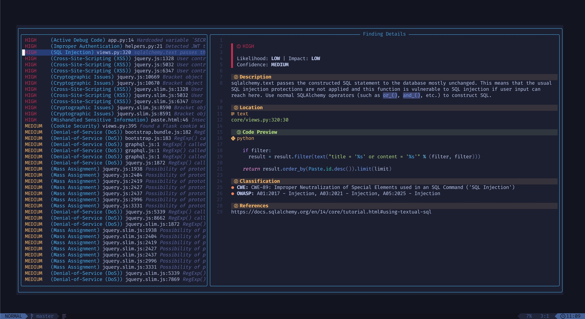

# redline.nvim

A lightweight, asynchronous security scanner for Neovim powered by [Opengrep](https://github.com/opengrep/opengrep). 

`redline.nvim` allows you to run static analysis security scans on your files or entire projects directly from your editor, displaying results in a searchable [Snacks.picker](https://github.com/folke/snacks.nvim).



## Features

- **Async Scanning**: Non-blocking `vim.system` calls so your UI doesn't freeze during a scan.
- **Snacks Integration**: Leverages the Snacks.nvim picker for results, including code previews and finding details.
- **Resume Support**: Instantly reopen your last scan results without re-running the tool.
- **Health Checks**: Built-in diagnostics via `:checkhealth redline`.

## Requirements

- **Neovim** 0.10+
- **[Opengrep](https://github.com/opengrep/opengrep)**: Must be installed and available in your `$PATH`.
- **[Snacks.nvim](https://github.com/folke/snacks.nvim)**: Used for the results UI and notifications.
- **[render-markdown](https://github.com/MeanderingProgrammer/render-markdown.nvim)**: Used to render markdown used to display results.

## Installation

Using [lazy.nvim](https://github.com/folke/lazy.nvim):

```lua
return {
  {
    "f0rest3xplorer/redline.nvim",
    dependencies = {
      "folke/snacks.nvim",
      "MeanderingProgrammer/render-markdown.nvim",
    },
    
    init = function()
      vim.api.nvim_create_user_command("RedLineProject", function()
        require("redline").project_scan()
      end, {})
      vim.api.nvim_create_user_command("RedLineFile", function()
        require("redline").file_scan()
      end, {})
      vim.api.nvim_create_user_command("RedLineResume", function()
        require("redline").resume_scan()
      end, {})
    end,
    keys = {
      { "<leader>Rp", "<cmd>RedLineProject<cr>", desc = "Project Scan" },
      { "<leader>Rf", "<cmd>RedLineFile<cr>", desc = "File Scan" },
      { "<leader>Rr", "<cmd>RedLineResume<cr>", desc = "Resume Last Scan" },
    },
    config = function()
      require("redline").setup()
    end,
  },

  {
    "folke/which-key.nvim",
    opts = function()
      local wk = require("which-key")
      wk.add({
        { "<leader>R", group = "RedLine", icon = "󰭎 " },
      })
    end,
  },
}
```

## Usage

### Commands
- `:RedLineProject`  or `<leader>Rp` — Scans the current working directory.
- `:RedLineFile` or `<leader>Rf` — Scans the currently active buffer.
- `:RedLineResume` or `<leader>Rr` — Reopens the picker with the results from the most recent scan.

### Picker Navigation
When the RedLine picker is open:
- `<Enter>`: Jump to the file, line, and column of the finding.
- `<Esc>`: Close the picker.

## Troubleshooting

If the plugin isn't working as expected, run:
```vim
:checkhealth redline
